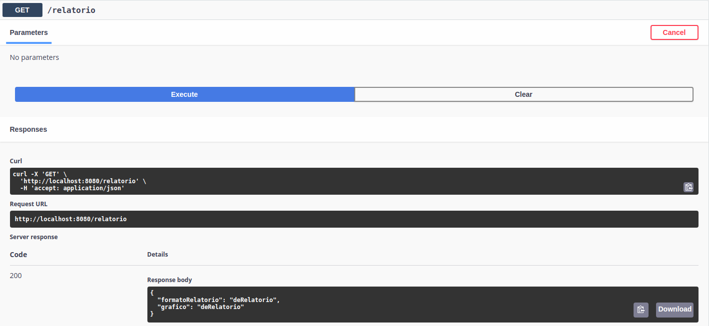

# Java_Singleton
# Java_Singleton
Atividade da disciplina de Padrões de Projetos


## Usando Atribuiçao
```
this.config = newConfig; 
```
Quando usado o método PUT, apenas é atualizado o GET Correspondente ao Resource



## Usando métodos Get e Set
```
config.setFormatoRelatorio(newConfig.getFormatoRelatorio());
config.setGrafico(newConfig.getGrafico());
```
Quando usado o método PUT, ambos os Métodos GET("/relatorio") e GET("/config") reproduzem a alteração


